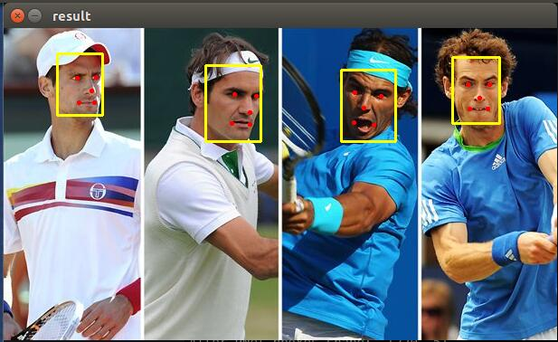

# MTCNN with Caffe in Python

## Usage
```Python
python main.py [image_path] [GPU_ID]
```
e.g.
```python
# Use CPU.
python main.py ./test/1.jpg

# Use GPU 0.
python main.py ./test/1.jpg 0
```

## Test
  
  
  


It takes:
```
./test/1.jpg  49ms  
./test/2.jpg  99ms  
./test/3.jpg  140ms  
```
on a Nvidia K40m GPU.

If you look for faster code, check [MTCNN in C++](https://github.com/DaFuCoding/MTCNN_Caffe).
